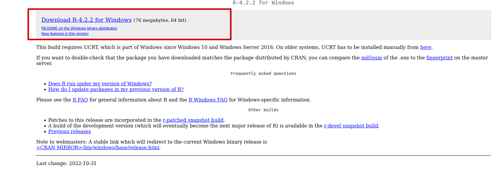
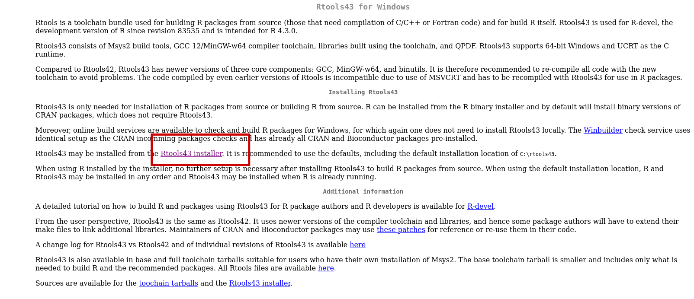

# R - Installing R

Rodrigo Esteves de Lima Lopes\
*Campinas State University*\
[rll307\@unicamp.br](mailto:rll307@unicamp.br)

## Introduction

[R](https://www.r-project.org/) is a statistical analysis software. It was not necessarily created for use in language studies; however, it has proved to be quite useful for such a function. [R](https://www.r-project.org/) is package-based: each time we load a package, there is a pre-defined set of pre-programmed functions. We will not create packages, but we will use those functions to do our research projects. Here [R](https://www.r-project.org/) will serve us to analyse, formatting and present data. We know that R can do much more than it, but that will be our cup of tea for this introduction.

## Download R

Go to [R](https://www.r-project.org/) website and download the latest version of R to your computer. There are binary versions for macOS, Linux and Windows. I do not have a Windows computer since 1999, so probably I will not be able to help you much if there is a Windows-specific issue.

### On a Macintosh

After you install R, I would strongly suggest you go to download and install some tools which might aid us to install some packages. If you are using a macOS computer, n the same link you downloaded R, scroll to the bottom of the page click on *tools*, install the following software:

-   clang
-   gfortran
-   tcltk

### On Windows

If you are using Windows, we are going to download R:

I also recommend you to install R tools, so we do not have any issue regarding packages installation.

### Linux

For Linux, there are some excellent tutorials:

-   [Ubuntu](https://cloud.r-project.org/bin/linux/ubuntu)

-   [Debian](https://cloud.r-project.org/bin/linux/debian)

-   [Fedora](https://cloud.r-project.org/bin/linux/fedora)

-   [Arch/Manjaro](https://wiki.archlinux.org/title/R)
